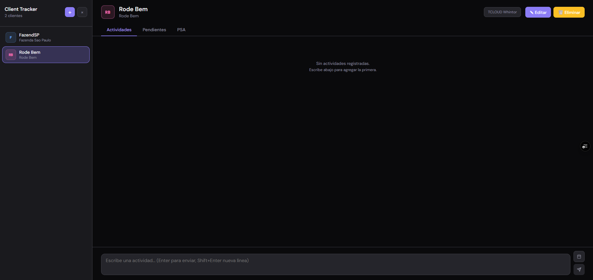
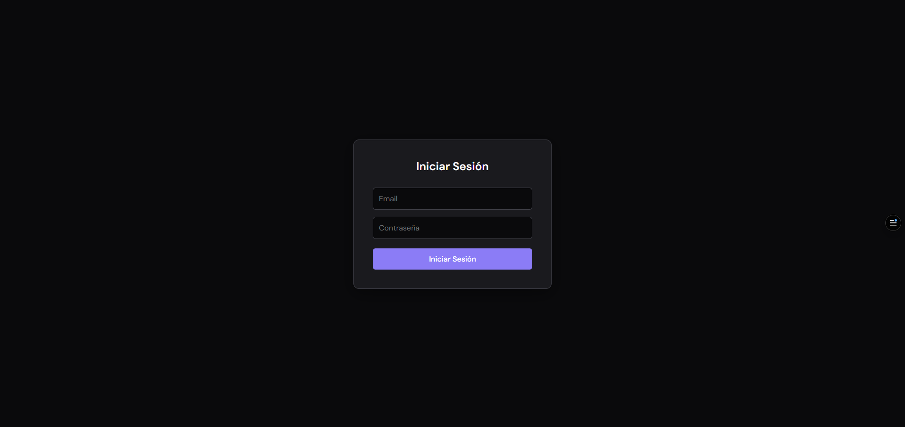

# 📋 Client Tracker

Una aplicación moderna y elegante para gestionar actividades, tareas pendientes y proyectos de clientes. Desarrollada con React y PostgreSQL / Supabase (autenticación opcional local) para una experiencia fluida y datos persistentes en la nube.

## 🖼️ Capturas de pantalla
- `screenshots/screenshot-1.png`: Área de trabajo principal con cliente seleccionado.
- `screenshots/screenshot-2.png`: Pantalla de login centrada y estilo modal.





## ✨ Características Principales

### 👥 Gestión de Clientes
- **Agregar clientes** con nombre, empresa y notas iniciales
- **Organización intuitiva** con avatares de colores únicos
- **Búsqueda rápida** por nombre o empresa

### 📝 Seguimiento de Actividades
- **Feed cronológico** de actividades por cliente
- **Fechas personalizables** para actividades pasadas o futuras
- **Edición en línea** de actividades existentes
- **Historial completo** de interacciones

### ✅ Lista de Pendientes
- **Tareas organizadas** por cliente
- **Filtros inteligentes**: Todos, Pendientes, Completados
- **Marcado de completado** con un clic
- **Edición rápida** de tareas

### 🎯 Tareas PSA (Project Success Activities)
- **Seguimiento de proyectos** específicos
- **Lista dedicada** para actividades críticas
- **Gestión simplificada** sin complejidades innecesarias

## 🛠️ Tecnologías Utilizadas

### Frontend
- **React 18** - Framework moderno para interfaces de usuario
- **CSS Variables** - Tema oscuro elegante y consistente
- **Lucide React** - Iconos modernos y accesibles
- **DM Sans/Mono** - Tipografía profesional

### Backend
- **Node.js + Express** - API REST ligera y eficiente
- **PostgreSQL** - Base de datos robusta via Supabase
- **Persistencia automática** - Sincronización en tiempo real

### Desarrollo
- **Create React App** - Configuración optimizada
- **ESLint** - Código limpio y consistente
- **Git** - Control de versiones profesional

## 🔐 Autenticación

La aplicación incluye un sistema de autenticación básico para proteger el acceso.

### Configuración
1. Copia el archivo `.env.example` a `.env.local`
2. Configura las variables de autenticación:
   ```env
   REACT_APP_AUTH_EMAIL=tu_email@gmail.com
   REACT_APP_AUTH_PASSWORD=tu_contraseña_segura
   ```
3. Reinicia la aplicación

### Credenciales por Defecto
- **Email**: admin@example.com
- **Contraseña**: 123456

**Nota**: Cambia las credenciales por defecto por unas seguras antes de usar en producción.

## 🚀 Instalación y Uso

### Prerrequisitos
- Node.js (versión 16 o superior)
- npm o yarn

### Instalación

```bash
# Clonar el repositorio
git clone https://github.com/tu-usuario/client-tracker.git
cd client-tracker

# Instalar dependencias
npm install

# Configurar variables de entorno
cp .env.example .env.local
# Edita .env.local con tus credenciales

# Iniciar la aplicación completa (servidor + cliente)
npm run dev

# O iniciar solo el cliente (requiere servidor corriendo)
npm start

# Iniciar solo el servidor API
npm run server
```

### Uso

1. **Agregar un cliente** haciendo clic en "Agregar cliente"
2. **Seleccionar un cliente** del panel izquierdo
3. **Navegar entre pestañas**: Actividades, Pendientes, PSA
4. **Agregar actividades** escribiendo en el campo inferior
5. **Gestionar tareas** con los controles intuitivos

## 🎨 Diseño y UX

### Tema Oscuro Profesional
- **Contraste optimizado** para largas sesiones de trabajo
- **Paleta de colores** cuidadosamente seleccionada
- **Tipografía legible** con tamaños mejorados

### Interfaz Intuitiva
- **Navegación lateral** con lista de clientes
- **Pestañas organizadas** por tipo de contenido
- **Acciones contextuales** al pasar el mouse
- **Feedback visual** inmediato

### Accesibilidad
- **Contraste alto** en todos los elementos
- **Navegación por teclado** completa
- **Etiquetas descriptivas** para lectores de pantalla
- **Fuentes ampliadas** para mejor legibilidad

## 📁 Estructura del Proyecto

```
client-tracker/
├── server/
│   ├── index.js              # API Express con SQLite
│   └── client-tracker.db     # Base de datos local
├── src/
│   ├── components/           # Componentes React reutilizables
│   │   ├── ActivityFeed.js   # Feed de actividades
│   │   ├── PendingList.js    # Lista de pendientes
│   │   ├── PSAList.js        # Lista de tareas PSA
│   │   ├── Sidebar.js        # Panel lateral de clientes
│   │   ├── ClientView.js     # Vista principal del cliente
│   │   └── AddClientModal.js # Modal para agregar clientes
│   ├── App.js                # Componente principal
│   └── index.css             # Estilos globales y variables CSS
├── package.json              # Dependencias y scripts
└── README.md                 # Este archivo
```

## 🔧 Scripts Disponibles

- `npm start` - Inicia el cliente React en modo desarrollo
- `npm run server` - Inicia el servidor API con SQLite
- `npm run dev` - Inicia cliente y servidor simultáneamente
- `npm run build` - Construye la aplicación para producción
- `npm test` - Ejecuta las pruebas

## 🌟 Características Destacadas

### Persistencia Local Robusta
- **SQLite integrado** - No requiere configuración externa
- **Sincronización automática** - Datos siempre actualizados
- **Migración transparente** - De localStorage a base de datos

### Rendimiento Optimizado
- **Carga eficiente** - Solo datos necesarios por cliente
- **Interfaz responsiva** - Funciona en cualquier tamaño de pantalla
- **Operaciones rápidas** - Base de datos local ultrarrápida

### Experiencia de Usuario Premium
- **Animaciones suaves** - Transiciones elegantes
- **Estados de carga** - Feedback visual durante operaciones
- **Confirmaciones inteligentes** - Prevención de pérdidas accidentales

## 🤝 Contribuir

¡Las contribuciones son bienvenidas! Para contribuir:

1. Fork el proyecto
2. Crea una rama para tu feature (`git checkout -b feature/AmazingFeature`)
3. Commit tus cambios (`git commit -m 'Add some AmazingFeature'`)
4. Push a la rama (`git push origin feature/AmazingFeature`)
5. Abre un Pull Request

## 📄 Licencia

Este proyecto está bajo la Licencia MIT - ver el archivo [LICENSE](LICENSE) para más detalles.

## 🙏 Agradecimientos

- **React** por el framework excepcional
- **SQLite** por la base de datos confiable
- **Lucide** por los iconos hermosos
- **La comunidad open source** por las herramientas increíbles

---

**Desarrollado con ❤️ para profesionales que valoran la organización y la eficiencia.**
